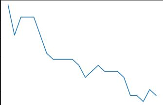

## Pokemon_Dataset_K-Nearest_Neighbors

I created the KNN portion of the project, where we are predicting the type 1 of pokemon in generations 1 through 7.

### Accuracy
The KNN model resuted in an accuracy of 0.878 using the best K-value of 1.

#### Screenshot
For this graph, the x axis is the values of K from 1 to 25, and the y axis is the models score, making it very obvious that the more neighbors that we add, the lower our score will be.

  

### Other Models
As a group, we also created models for SVM and Decision Trees, where the Decision Tree model had the highest accuracy with 0.9997.

### Conclusion
Our conclusion was that KNN was actually the worst model out of the three that we made, and that the Decision Tree was the best.